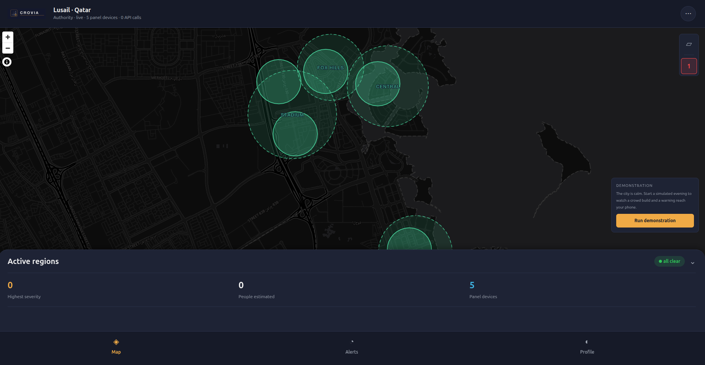
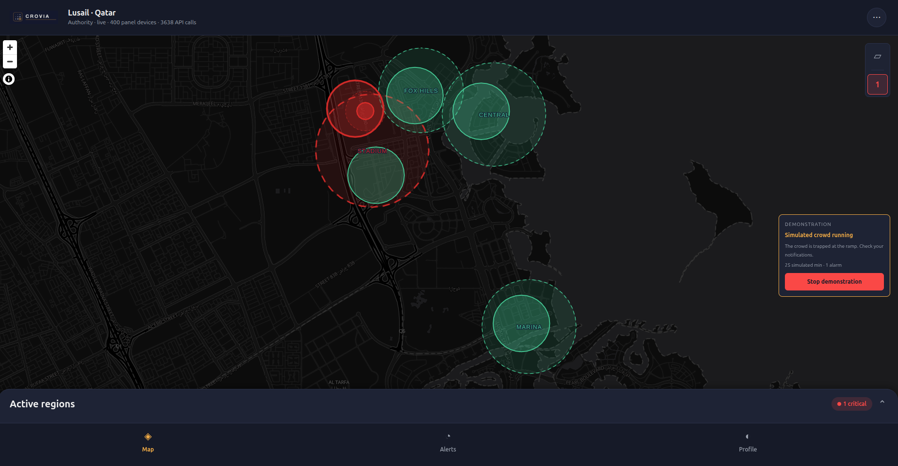
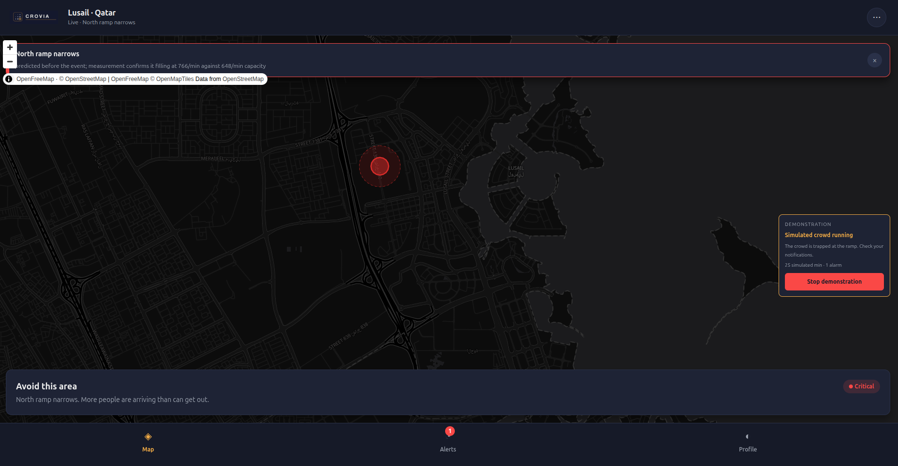

# CROVIA

**CROVIA finds dangerous crowds before they become deadly, using the mobile network itself — no GPS, no cameras, and no need for anyone to switch location on.**

This prototype is built for **Lusail, Qatar**.

---

## What it looks like

### The city is calm

The authority view. Every watched zone is green. Nothing is being spent, because there is nothing to look at yet.



### A crowd forms and the alarm fires

The same view a few minutes later. One zone has turned red. The system moved from cheap watching to close measurement only for that zone — the rest of the city stayed green and stayed cheap.



### The warning reaches a person's phone

The citizen view. A plain instruction, a red area to avoid, and the reason in one sentence. No map reading required.



---

## The problem

Crowd crush kills people in places that were completely safe a few minutes earlier. It happens when more people arrive at a narrow place than that place can let through. The crowd does not have to panic. The people at the back cannot see the problem at the front, so they keep pushing forward, and the pressure has nowhere to go.

The systems that exist today usually find out too late:

- **Cameras** only see where a camera is pointed, and they stop being useful in darkness, in rain, or once the crowd is thick enough that heads overlap.
- **Phone GPS apps** only work for people who installed the app, switched location on, and left it running. In a real crowd that is a small and unpredictable share of the people present.
- **Counting at the gate** tells you how many went in. It does not tell you where they are standing now.

## The idea

CROVIA asks the **mobile network operator**, not the phone.

A mobile network already knows roughly where each phone is, because it has to, in order to deliver calls. Nokia's **Network as Code** platform opens that knowledge through a set of standard telecom APIs called **CAMARA**. CROVIA is built on those APIs.

One consequence matters more than all the others: **the positioning is done by the network, not by the handset.** A person does not need to turn location services on. They do not need the app open. If the phone is connected to the network, CROVIA can tell whether it is inside a zone.

The trade is accuracy. Network positioning is accurate to somewhere between a few hundred metres and a few kilometres, not a few metres. So CROVIA is built around a different question. Instead of asking *"exactly where is everyone standing?"* — which the network cannot answer — it asks:

> **Are more people arriving at this narrow point than it can let through?**

That question can be answered from rough data, and it can be answered **early**, because it compares a flow of arrivals against a fixed physical limit rather than waiting for a dangerous density to appear.

Every watched zone has a **bottleneck**: the narrowest point people have to pass through, such as a ramp, a gate, or a crossing. How many people that bottleneck can pass each minute follows from its width, using a measured figure from crowd science. If the rate of arrivals is heading above that limit, pressure will build — and for a scheduled event, such as a match ending, this is known *before the first person stands up*, at no API cost at all.

That prediction never raises the alarm by itself. It only lowers the bar for confirming: a crowd that was predicted does not have to prove all over again that it is a crowd, only that it is really filling. This is what makes the warning early instead of late.

---

## How the pieces work together

The whole design is a ladder. Each step costs more than the one before it, so a step is only taken when the cheaper step below it gives a reason.

**Step 1 — Free hints.** The system listens for congestion notifications from the network. Network congestion rises when many people gather in one place. This costs nothing per event, but it carries **no device identity and no location**, so it can only say "something may be happening somewhere near this device". It starts an investigation. It can never locate a crowd.

**Step 2 — Is anyone even reachable?** Before paying to locate phones, the system checks which ones can be reached at all. A phone that is switched off or out of coverage cannot be located, so asking about it would be money spent on an answer of "unknown".

**Step 3 — Counting, cheaply.** For the reachable phones in a small random sample, the system asks a yes/no question: *is this phone inside this zone?* This is the main sensor. It needs no subscription, and it returns no coordinates — only yes or no. That makes it both the cheapest call and the most private one. Repeating it over time gives the thing that actually matters: whether the crowd is growing, and how fast.

**Step 4 — The judgement.** The arrival rate is compared against what the bottleneck can pass. This is plain arithmetic in [`backend/app/detect/danger.py`](backend/app/detect/danger.py). It is not a model, it cannot hallucinate, and it can be checked by hand afterwards.

**Step 5 — Only after an alarm: where exactly?** Once the alarm has fired, and only then, the system spends on actual coordinates. This answers whether the crowd is pressed against the bottleneck or spread out safely across a wider area — the context an operator needs in order to act. It is bought once, not continuously.

**Step 6 — Act.** Warnings go out to the people in the zone and to the operator. Responders heading to the scene get their connection protected, and their arrival is confirmed automatically when they enter the area.

The important property of this ladder is that **the city is cheap to watch and only an incident is expensive.** In the calm screenshot above, nothing is being spent. In the alarm screenshot, spending is concentrated on one zone while the rest of the city stays on the cheap steps.

---

## The six CAMARA APIs

CROVIA uses six of Nokia's Network as Code APIs. Each one has a specific job, and the cost of each one shaped where it sits on the ladder.

| API | What CROVIA asks it | Why this one |
|---|---|---|
| **Congestion Insights** | "Is the network near this phone overloaded?" | The free hint at the bottom of the ladder. Carries no identity and no location, so it can start an investigation but never locate a crowd. |
| **Device Status (Reachability)** | "Can this phone be reached at all?" | A cheap filter. Screening first avoids paying for location answers that would come back as "unknown". |
| **Location Verification** | "Is this phone inside this zone? Yes or no." | The main sensor. No subscription needed and no coordinates returned, so it is the cheapest call and the most private one. Counting is built on it. |
| **Location Retrieval** | "What are this phone's actual coordinates?" | The expensive one. Spent once, after an alarm, to see whether the crowd is pressed against the bottleneck or spread out. |
| **Geofencing** | "Tell me when this phone enters or leaves this zone." | Used for known responders — police, medical, security — so arrival at a scene is confirmed without anyone reporting it. |
| **Quality on Demand** | "Protect this phone's connection to our server." | The only one that **changes** the network instead of reporting on it. See below. |

### Why Quality on Demand is in here

A warning has to travel over the same cell that is congested. That cell is congested *because* the crowd formed. So the network is at its worst at exactly the moment the message matters most.

When an alarm fires, CROVIA asks the network to hold a steady, low delay on the connection between the responders' phones and CROVIA's own server. It asks for stable delay rather than maximum download speed, because a map and an "acknowledge" button need a message to arrive on time, not quickly delivered video. The session is opened when the alarm fires and closed when the incident ends, because it costs money for as long as it is open.

---

## The AI layer

There is an AI agent, and understanding **what it is not allowed to do** is the important part.

The agent is built with **LangGraph**, running a language model through **Groq**. It is given four tools, which do real work rather than returning text:

| Tool | What it does |
|---|---|
| `arm_chokepoints` | Start watching the narrow points of a zone — begin collecting the free network signals for it |
| `verify_and_filter` | Check which sampled phones are reachable, then ask the yes/no "inside this zone?" question for those that are |
| `retrieve_locations_batch` | Buy actual coordinates for a batch of phones — the expensive step |
| `judge` | Ask the arithmetic rules whether this is dangerous |

**What the agent decides:** which zone deserves attention, in what order, how much budget to spend on it, when to stop looking, and how to explain the decision to an operator in words a person can act on.

**What the agent may never decide:** whether people are in danger. That answer comes only from `judge`, which is arithmetic. The agent's job is to call it and report what it said.

The reason is simple. If a language model made the safety call, nobody could answer *"why did it fire?"* or, much worse, *"why did it not fire?"* A rule can be checked by hand after the fact. A model's reasoning cannot.

There is a second safety net. If no model key is set, or the provider has an outage in the middle of an incident, a **deterministic policy** takes over the agent's job. It is not a placeholder — it is a working set of rules that decides where to look and what to spend. A crowd-safety system must not stop working because an API key expired. The rules are the floor; the model is an improvement on top of them.

The agent is also given judgement rules that a simple threshold would miss. For example: if every district reports heavy congestion at the same instant, that is a network fault and not a crowd, so spend nothing. And busy zones must be compared against the calm part of the city rather than the city average, because when several districts are genuinely busy, the average is dragged up by the crowds themselves and nothing looks unusual any more.

---

## About the numbers

CROVIA runs on a set of tuned values: how wide a narrow point has to be before it is a worry, how many people to sample, how often to re-check a calm zone versus a dangerous one, how much of the budget to hold in reserve, how large a zone circle may be.

**None of these are universal, and they are deliberately not presented as if they were.** The right values depend on the city and on the situation:

- **The shape of the place.** Street and gate widths, how the districts connect, whether crowds move along corridors or spread across open ground.
- **The network.** How densely base stations are placed decides how accurate the positioning is, and therefore how small a zone can usefully be. Some countries and networks also enforce a minimum area size by regulation.
- **How many people carry the app.** The sample size needed to estimate a crowd depends on what share of the population is in the pool of people who agreed to take part.
- **The event.** A football match emptying all at once is a different problem from a shopping street filling gradually through an afternoon.
- **The budget.** Telecom APIs charge per call, so how often a zone is checked is a money decision as much as a safety one.

The values in this repository were chosen and tested **for Lusail**. Moving CROVIA to another city means measuring that city and setting its own values. The method carries over; the constants do not.

The measured performance of the current settings — how many dangerous crowds were caught, how many false alarms were raised, how early the warnings arrived, and what it cost — is written up in [`backend/sim/RESULTS.md`](backend/sim/RESULTS.md).

---

## Privacy

Crowd safety usually means surveillance. This design avoids that.

- **Consent first.** A citizen who installs the app and agrees is placed in a waiting pool. While they are there they are completely untracked, and the mobile network is never asked anything about them.
- **Only a sample is ever watched.** When monitoring starts, a random sample is drawn from that pool, and the crowd is estimated from the sample. The system never watches everybody.
- **Phone numbers are hashed immediately.** One component, the Vault, is the only part of the system allowed to hold a real phone number. It is hashed as soon as a person is enrolled. The detection engine, the AI layer and every log line work only on anonymous hashes. The real number is read back for a single moment, when the call to the network is actually made.
- **The cheapest call is also the most private one.** The yes/no "inside this zone?" question returns no coordinates at all. Coordinates are bought once, after an alarm has already fired.

## Reliability

The live detection engine runs entirely in memory. Alarms are written to the database through a hook that is allowed to fail quietly. If the database goes down during a mass-casualty event, the engine keeps detecting and keeps warning people instead of stopping to wait for a write.

---

## Technology used

**Backend**

| | |
|---|---|
| Language | Python |
| Web framework | FastAPI, served by Uvicorn |
| Data validation | Pydantic |
| Database | SQLAlchemy over PostgreSQL in deployment, SQLite locally |
| Cache | Redis (optional — the system runs without it) |
| Authentication | JWT tokens, bcrypt password hashing |
| Telecom | Nokia Network as Code Python SDK (`network_as_code`) |
| Maths | NumPy |
| Packaging | Docker |
| Hosting | Render, configured by [`render.yaml`](render.yaml) |

**AI layer**

| | |
|---|---|
| Agent framework | LangGraph |
| Model access | Groq, through LangChain |
| Fallback | A deterministic rule policy that needs no model at all |

**App**

| | |
|---|---|
| Framework | React Native with Expo — one codebase for web, iOS and Android |
| Language | TypeScript |
| Map | MapLibre GL |
| Map tiles | OpenFreeMap (OpenStreetMap data, no API key, no account, no quota) |
| Geometry | Turf |
| Push notifications | Expo Notifications |
| Drawing | React Native SVG |

**Testing without real phones**

Nokia publishes simulated test devices whose answers are fixed and known. That means the entire pipeline — including every failure path — can be built, tested and demonstrated without real handsets, real consent, or the risk of using up a quota. There is also a full simulated city in the repository, so a crowd can be made to build and an alarm to fire on demand.

---

## Repository layout

```
backend/
  app/
    camara/      the six Nokia CAMARA APIs behind one interface
                 (a live client, and a simulator using Nokia's test numbers)
    core/        the city map, the privacy vault, the API budget
    detect/      the detection engine and the danger rules
    ai/          the agent that decides where to look (never whether it is dangerous)
    api/         HTTP endpoints, including the webhooks the network calls back on
    usersDB/     accounts, consent, incidents
  sim/           a simulated city, for measuring the engine
  scenario/      a second, independent simulated city, for judging it from outside
  tests/

crovia-ui/       the app: citizen, operator and authority views
  src/geo/       the geography of the pilot city, shared by backend and app
```

There are two separate simulations on purpose. `sim/` measures how the engine behaves. `scenario/` builds a different world behind a different network and judges CROVIA from the outside, so a mistake shared between the engine and its own test world cannot hide.

Several modules have a matching `.md` file beside them explaining the design — for example [`backend/app/detect/engine.md`](backend/app/detect/engine.md) and [`backend/app/core/budget.md`](backend/app/core/budget.md).

---

## Running it

The system is deployed and always running. Nothing needs to be installed.

### See the Nokia APIs called live

Open this link. No account needed:

**https://crovia.onrender.com/api/demo/apis**

It calls all six Network as Code APIs — Congestion Insights, Geofencing, Location Verification, Location Retrieval, Device Status and Quality on Demand — against Nokia's four test devices, and shows the raw answers. That includes the two devices whose answers contradict Nokia's own documentation. They are shown rather than hidden, because a page that only prints the calls that worked proves nothing.

### See a crowd form

Nokia gives only four test numbers, which is not enough to make a crowd. So the app has a built-in simulated evening in Lusail.

**https://crovia-nu.vercel.app**

Sign up as a citizen with any email and tick the consent box. Or sign in as an authority operator with:

```
email:     judge@crovia.app
password:  CroviaJudge2026
```

Then press **Run demonstration**. A crowd forms in Lusail, an alarm fires several minutes before the crowd becomes dangerous, and everyone in the affected district is warned. When the crowd clears, an all-clear message goes out explaining why. The citizen view and the operator view show the same incident from the two different sides.

Three things to know:

- **Wait about two minutes** to see the change appear on the map.
- **Only one account can run the demonstration at a time.**
- **Press Stop demonstration before switching accounts.** If you want to move between the citizen account and the authority account, stop the demonstration first, then sign out.

### Run the tests yourself

```bash
cd backend
python3 -m venv venv
./venv/bin/pip install -r requirements.txt
```

**Unit tests** — 87 checks, about half a minute. Each one tests a single rule:

```bash
PYTHONPATH=. ./venv/bin/python tests/run_all.py
```

**Six full simulated evenings in Lusail**, three seeds each:

```bash
PYTHONPATH=. ./venv/bin/python scenario/run_all.py
```

Three of those six must raise **no alarm at all** — a packed stadium during a match, a crowd that comes close to danger but never reaches it, and a network fault that makes the whole city look busy at once. Staying silent is the harder test, and it is what a false alarm would fail.

Neither command needs a Nokia key, a database, or any configuration, and neither ever touches the real network.

The engine being tested is the real backend engine in [`backend/app/`](backend/app/). It reads nothing from the simulated world — only the same CAMARA questions that Nokia answers.

To look at how the tests work: [`scenario/run_all.py`](backend/scenario/run_all.py), [`scenario/catalogue.py`](backend/scenario/catalogue.py), [`scenario/world.py`](backend/scenario/world.py), [`scenario/network.py`](backend/scenario/network.py), [`tests/run_all.py`](backend/tests/run_all.py), [`sim/sweep.py`](backend/sim/sweep.py) and [`sim/RESULTS.md`](backend/sim/RESULTS.md).

### Run the whole system on your own machine

```bash
cd backend
cp .env.example .env
CROVIA_TWIN=1 PYTHONPATH=. ./venv/bin/uvicorn app.main:app

cd crovia-ui && npm install && npm run web
```

Every setting in `.env` is optional. With an empty file the backend uses SQLite, replaces the live network with Nokia's test numbers, and replaces the language model with the deterministic rules. Detection works fully in this mode. `CROVIA_TWIN=1` runs the simulated city, which is what produced the screenshots above.

---

## Honest limits

- **Crowd size is an estimate, not a count.** It is published as a range, and the alarm never depends on that number alone.
- **The simulated city is not Lusail itself.** The districts and landmarks are real; the corridors between them are modelled, not taken from a real walking map.
- **Telecom pricing is not public.** Call counts are measured. The money they cost is not.
- **Test devices do not move.** In the sandbox no device ever crosses a zone boundary, so the enter/leave events never fire there. This is exactly why counting is the main sensor and geofencing is only a bonus — counting works either way.
